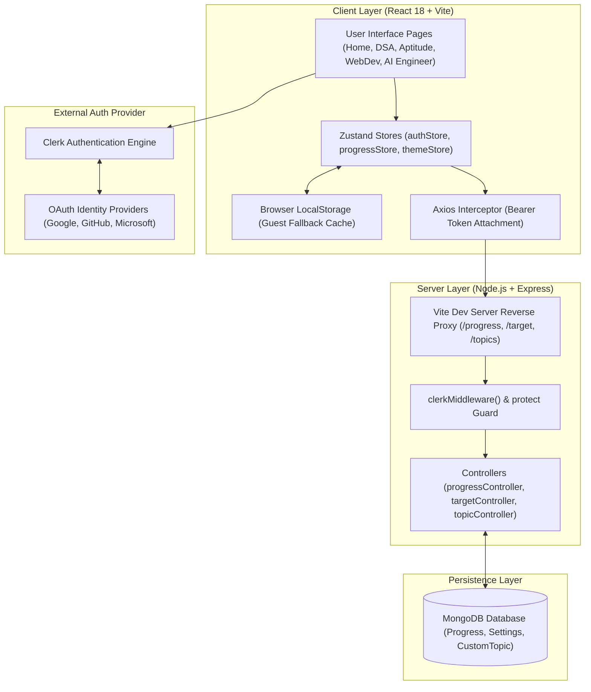
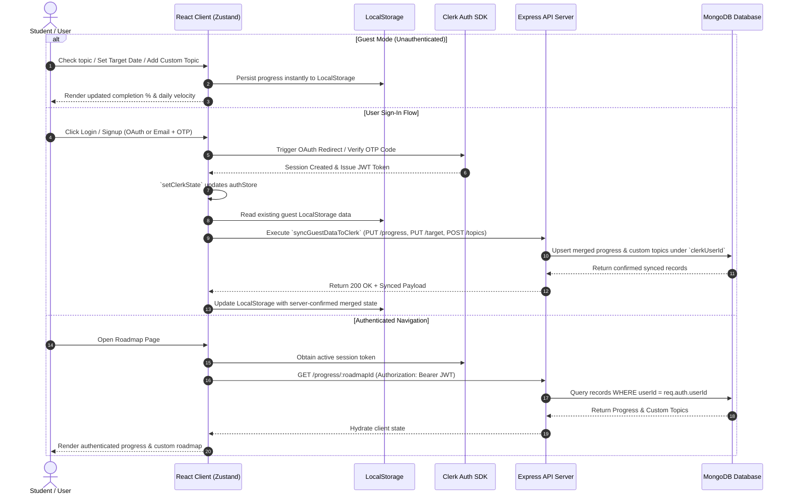

<div align="center">

  <br />
  
  
  # 🎓 MY / YOUR / OUR CS GUIDE
  ### *Engineered for Computer Science Success & Career Preparation*

  <p align="center">
    <i>"My learning. Your preparation. Our community."</i>
  </p>

  <p align="center">
    <a href="#curated-roadmaps">Roadmaps</a> •
    <a href="#key-features">Features</a> •
    <a href="#tech-stack">Tech Stack</a> •
    <a href="#system-architecture--workflow">Architecture</a> •
    <a href="#getting-started">Getting Started</a> •
    <a href="#environment-variables">Environment Setup</a>
  </p>

  <p align="center">
    
    
    
    
    
    
  </p>

</div>

---

## 🌟 Overview

**MY/YOUR/OUR CS GUIDE** is a modern SaaS-style web platform built for disciplined Computer Science preparation, placement prep, and full-stack software development. It eliminates learning clutter by providing structured, interactive checklists, real-time velocity analytics, target deadline planners, custom topic additions, and hybrid cloud synchronization.

---

## 🗺️ Curated Roadmaps

The platform features four meticulously crafted study guides designed to take students from core concepts to production mastery:

| Roadmap | Focus Areas | Key Topics Included |
| :--- | :--- | :--- |
| ⚡ **DSA Guide** | Data Structures & Algorithms | Foundations, Arrays, Strings, Trees, Dynamic Programming, Graphs, and exact LeetCode problem mappings. |
| 🧮 **Aptitude Guide** | Quantitative, Logical & Verbal | Step-by-step formulas, syllabus details, question types, and shortcut tricks for placement exams. |
| 🌐 **Web Development Concepts** | Frontend, Networking & Backend | Browser internals, DOM rendering pipelines, HTTP/HTTPS security, caching strategies, and System Design. |
| 🤖 **Full Stack AI Engineer** | GenAI & Specialization | LLMs, Prompt Engineering, Embeddings, ChromaDB, Vector Search, RAG Pipelines, AI Agents, and MERN + FastAPI. |

---

## ✨ Key Features

### 🚀 Real-time Velocity & Progress Analytics
- **Dynamic Percentage Calculations**: Instant topic and subtopic progress tracking across all guides.
- **Placement Target Date Planner**: Set target placement dates to automatically compute required daily and weekly study velocity.
- **Bulk Phase Checklists**: One-click completion toggling per phase or topic section.

### 🔐 Production-Grade Authentication (Clerk)
- **Multi-Provider Social Login**: One-tap OAuth login with **Google**, **GitHub**, and **Microsoft**.
- **Email/Password & OTP Verification**: Secure sign-up flow with 6-digit email verification codes and inline password resets.
- **Protected Sessions**: Secure HTTP token management via `@clerk/clerk-react` and `@clerk/express`.

### 🔄 Hybrid Offline & Cloud Sync
- **Zero-Barrier Guest Mode**: Guests can browse, check off topics, set target dates, and add custom topics stored strictly in `LocalStorage`.
- **Intelligent Account Migration**: Logging into an account automatically detects offline progress and seamlessly merges it with the cloud database.

### 🎨 Modern Glassmorphism UI & Theme Engine
- **Custom Light & Dark Themes**: Sleek contrast, HSL color palettes, and glassmorphism panels.
- **Micro-Animations**: Powered by `framer-motion` for fluid page transitions, cards, and interactive element hover states.
- **Custom Topic Management**: Ability to create custom topics and subtopics directly within any roadmap.

---

## 🛠️ Tech Stack

### **Frontend Client (`/client`)**
- **Core Framework**: React 18 (Vite SPA)
- **Styling**: Vanilla CSS Variables + TailwindCSS (Glassmorphism & animated mesh backgrounds)
- **State Management**: Zustand (Auth state, progress mapping, theme state)
- **Icons & Motion**: React Icons, Lucide React, Framer Motion
- **Authentication**: `@clerk/clerk-react`
- **HTTP Client**: Axios with dynamic bearer token request interceptors

### **Backend Server (`/server`)**
- **Runtime**: Node.js & Express.js
- **Database**: MongoDB & Mongoose ORM
- **Authentication Middleware**: `@clerk/express` (`clerkMiddleware` & `getAuth`)
- **CORS & Cookies**: `cors`, `cookie-parser`, `dotenv`

---

## 🏗️ System Architecture & Workflow

### 1. High-Level Architecture Diagram



---

### 2. End-to-End User & Data Synchronization Workflow



---

### 3. Detailed Workflow Breakdown

#### A. Guest Offline Progress Engine
1. **Action**: The user opens any of the 4 roadmaps without signing in.
2. **Local Persistence**: `progressStore.js` writes checkbox toggles, custom subtopics, and target dates straight to `LocalStorage`.
3. **Analytics**: Completion percentages and required daily/weekly completion targets calculate dynamically in real time without network overhead.

#### B. Clerk Authentication & Session Security
1. **Multi-Provider OAuth**: Users click Google, GitHub, or Microsoft SSO buttons. Clerk handles the OAuth 2.0 handshake and redirects back to `/sso-callback`.
2. **Email Verification**: For email registrations, Clerk issues a 6-digit OTP verification code before creating a session.
3. **Session Interceptor**: On every API request, the Axios request interceptor calls `window.Clerk.session.getToken()` and attaches `Authorization: Bearer <token>`.
4. **Server Verification**: `clerkMiddleware()` and `protect` middleware verify token signatures on backend API endpoints using `@clerk/express`.

#### C. Intelligent Cloud Synchronization (`syncGuestDataToClerk`)
1. **Detection**: Upon successful authentication, `App.jsx` triggers `syncGuestDataToClerk()`.
2. **Merge Algorithm**:
   - Local progress is fetched from `LocalStorage`.
   - Existing cloud progress is fetched from MongoDB.
   - Checked items from both sources are merged without duplicate keys.
3. **Database Storage**: The merged state is saved in MongoDB using the user's `clerkUserId` as the primary partition key across `Progress`, `Settings`, and `CustomTopic` collections.

---

## 📁 Repository Structure

```text
MYO CS Guide/
├── client/                     # React + Vite Frontend
│   ├── src/
│   │   ├── components/         # Reusable UI, Layout, & Roadmap Components
│   │   │   ├── layout/         # Navbar, Footer, RoadmapLayout
│   │   │   ├── roadmap/        # PhaseSection, ProgressPanel, TargetDatePlanner, ResetControls
│   │   │   └── ui/             # GlassCard, ThemeToggle, Badge
│   │   ├── data/               # Curated Roadmap Data (dsaGuideData, webDevData, aiEngineerData, etc.)
│   │   ├── pages/              # Home, Login, Signup, DSAGuide, AptitudeGuide, WebDevGuide, AIEngineerGuide
│   │   ├── store/              # Zustand Stores (authStore, progressStore, themeStore)
│   │   ├── styles/             # Global CSS Variables & Tailwind Styles
│   │   └── utils/              # Axios Interceptor & LocalStorage Utilities
│   ├── .env.example            # Environment template for frontend
│   └── package.json
│
├── server/                     # Node.js + Express Backend
│   ├── config/                 # Database Connection (MongoDB)
│   ├── controllers/            # progressController, targetController, topicController
│   ├── middleware/             # Clerk Auth Verification & Global Error Handler
│   ├── models/                 # Mongoose Schemas (Progress, Settings, CustomTopic)
│   ├── routes/                 # Express API Endpoints (/progress, /target, /topics)
│   ├── .env.example            # Environment template for backend
│   ├── server.js               # Entry point
│   └── package.json
│
├── .gitignore                  # Git ignore file (excludes secrets & dependencies)
└── README.md                   # Documentation
```

---

## 🚀 Getting Started

### Prerequisites
- **Node.js** (v18 or higher recommended)
- **MongoDB** running locally (`mongodb://localhost:27017`) or a **MongoDB Atlas URI**
- A **Clerk** account ([clerk.com](https://clerk.com)) for authentication keys

---

## ⚙️ Environment Variables

### 1. Client Environment (`/client/.env`)
Create a `.env` file in the `client` directory:
```env
VITE_CLERK_PUBLISHABLE_KEY=pk_test_your_clerk_publishable_key_here
```

### 2. Server Environment (`/server/.env`)
Create a `.env` file in the `server` directory:
```env
PORT=5000
MONGO_URI=mongodb://localhost:27017/myo_cs_guide
NODE_ENV=development

# Clerk Keys (from Clerk Dashboard -> API Keys)
CLERK_PUBLISHABLE_KEY=pk_test_your_clerk_publishable_key_here
CLERK_SECRET_KEY=sk_test_your_clerk_secret_key_here
```

---

## 🏃 Running Locally

### 1. Install Dependencies

```bash
# Install Server Dependencies
cd server
npm install

# Install Client Dependencies
cd ../client
npm install
```

### 2. Start Development Servers

In one terminal (Backend):
```bash
cd server
npm run dev
```
*Server will start at `http://localhost:5000` and connect to MongoDB.*

In a second terminal (Frontend):
```bash
cd client
npm run dev
```
*Client will start at `http://localhost:5173`.*

---

## 📊 Database Models Summary

- **Progress**: Stores completed roadmap checkboxes indexed by `userId` (Clerk User ID) & `roadmapId`.
- **Settings**: Stores user preferences and target placement completion dates indexed by `userId`.
- **CustomTopic**: Stores custom user-added topics and subtopic checklists indexed by `userId` & `roadmapId`.

---

## 📜 License

Distributed under the MIT License. See `LICENSE` for more information.

---

<div align="center">
  <sub>Built with ❤️ by Divyam Samant for Computer Science Students & Engineers worldwide.</sub>
</div>
